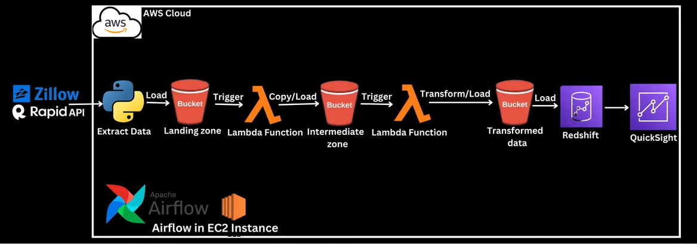
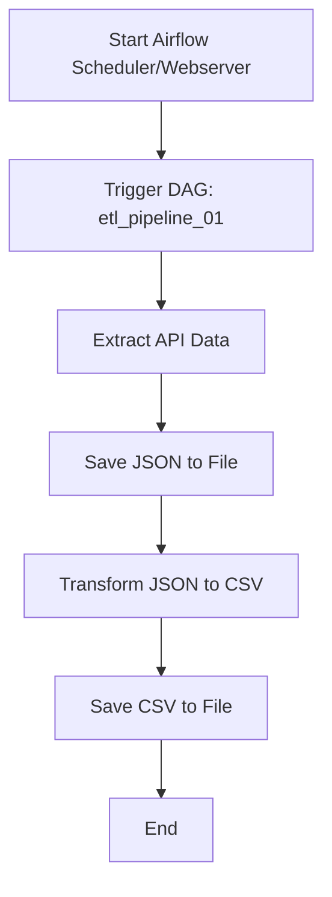

# Airflow Local ETL Project

This project sets up a local Apache Airflow environment using Docker Compose to orchestrate ETL pipelines for extracting data from APIs, transforming it, and saving results as CSV/JSON files.

---

## 🗂️ Project Structure

```
ETL-PROJ-AWS-01/
├── .gitignore
├── Arch_Flow.PNG
├── copyRawJSONFile-lambdaFunc.py
├── etl_pipeline_01.py
├── README.md
└── transformation-convert-to-csv-lambdaFunc.py
```

---

## 🚀 Quickstart

1. **Clone the repo and navigate to the project directory:**
   ```bash
   cd airflow-localproj-setup
   ```

2. **Start Airflow containers:**
   ```bash
   docker compose up -d
   ```

3. **Initialize Airflow DB (if needed):**
   ```bash
   docker compose run airflow-webserver airflow db init
   ```

4. **Access Airflow UI:**  
   Open [http://localhost:8080](http://localhost:8080)  
   Login:  
   - Username: `admin`  
   - Password: `admin`

---

## ⚙️ ETL Pipeline Flow

The main ETL pipeline is defined in [`dags/etl_pipeline_01.py`](airflow-localproj-setup/dags/etl_pipeline_01.py).  
It performs the following steps:

1. **Extract:**  
   [`extract_api_data_fn`](airflow-localproj-setup/dags/etl_pipeline_01.py) calls an external API, saves the JSON response to a file.

2. **Transform:**  
   Data is processed and converted to CSV (see [`transformation-convert-to-csv-lambdaFunc.py`](transformation-convert-to-csv-lambdaFunc.py)).

3. **Load:**  
   Final CSV/JSON files are saved in the `dags/` folder for downstream use.

---

## Architecture Diagram



---

## 📊 Flow Diagram



---

## 📝 Troubleshooting

- **DB Initialization Error:**  
  If you see `ERROR: You need to initialize the database. Please run airflow db init`, run:
  ```bash
  docker compose run airflow-webserver airflow db init
  docker compose up -d
  ```

- **Clean Restart:**  
  To reset everything:
  ```bash
  docker compose down -v --remove-orphans
  docker compose up -d
  ```

See [Clean Restart.md](airflow-localproj-setup/Clean%20Restart.md) and [Steps.md](airflow-localproj-setup/Steps.md) for more details.

---

## 🛠️ Customization

- **API Config:**  
  Edit [`api_config.json`](api_config.json) to change API endpoints or parameters.
- **DAGs:**  
  Add new DAGs to [`dags/`](airflow-localproj-setup/dags/) and restart Airflow.

---

## 📚 References

- [Apache Airflow Documentation](https://airflow.apache.org/docs/)
- [Docker Compose](https://docs.docker.com/compose/)

---